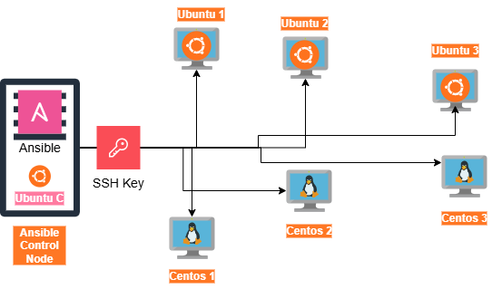

### This Repo is for Ansible Library and POC of Realtime Scenarios.
**It covers below concepts till date**
- Playbooks
- Tasks
- Play
- Modules
    File , Copy , Stat , Blockinfile , lineinfile , Fetch , Find , Replace , Template , assemble , archive , unarchive,
    Synchronize, yum , apt , service ,shell  
- Ansible Vault
- Secrets
- Error Handlings
- Collections
- Roles
- Variables
- Jinja2
- loops

---
## 📊 Our Deployment Architecture Design of Connected Nodes 

    

 

---
**Realtime POC's Scenarios**
1. Managing Ngnix Software over 6 OS's (Centos & Ubuntu) --- Includes Installation,Uninstallation,Patching
2. Managing Java Software over 6 OS's (Centos & Ubuntu) --- Includes Installation,Uninstallation
